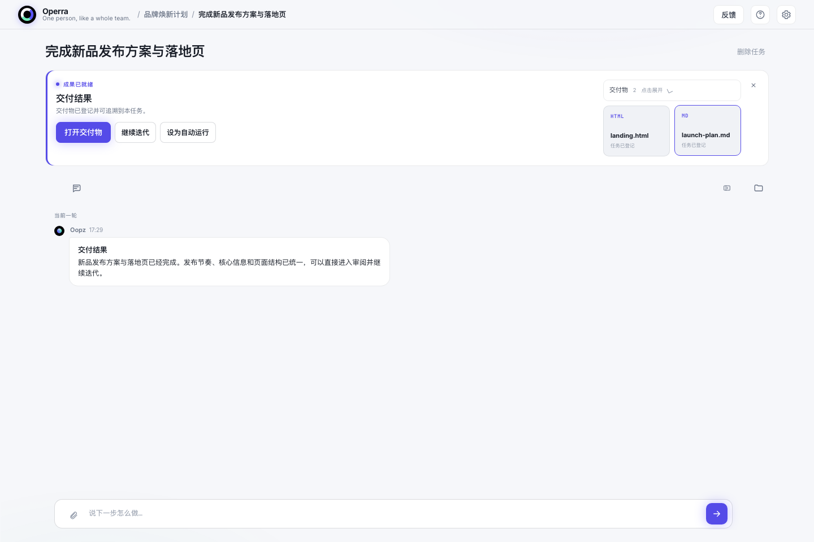
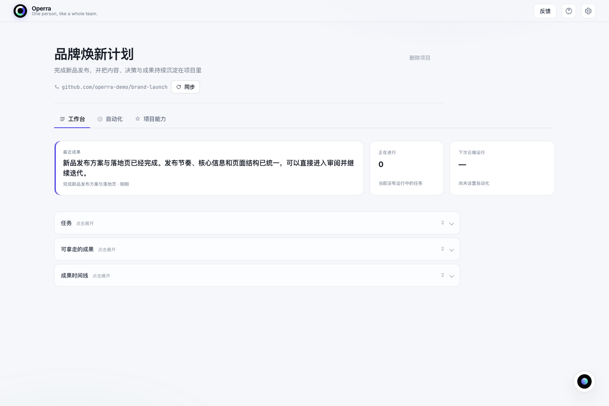
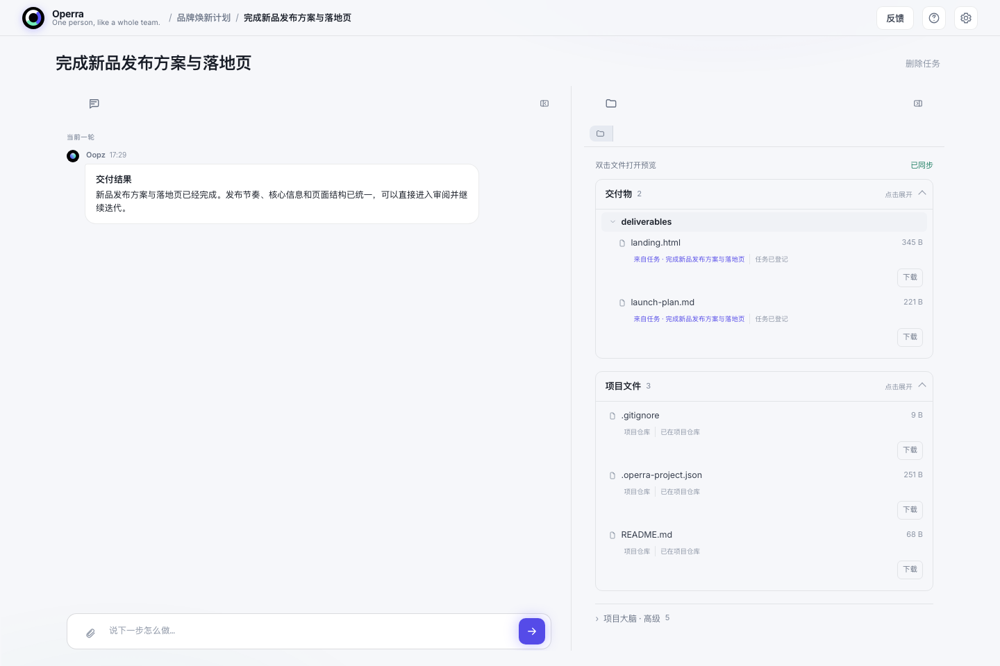

# Operra

Operra 是面向 OPC（One Person Company，一人公司）的 AI 工作台。你只需要和 AI 运营官 **Oopz** 对话、说明目标；Operra 会把目标组织成 Task，交给 QCA（Qoder Cloud Agents）在你的项目仓库中执行，并把过程、成果和需要你决定的事项带回一个工作台。

> 当前为 macOS **未签名测试版**。仅支持 Apple Silicon（M1、M2、M3、M4 及更新机型），尚未使用 Apple Developer ID 签名或 Apple 公证。

<p align="center">
  
</p>
<p align="center"><sub>首页先呈现最近成果和长期项目，让你一打开就知道团队交付了什么。</sub></p>

## 它解决什么问题

传统 Agent 工具往往要求用户先理解模型、Prompt、Agent 编排和运行日志。Operra 把这些执行细节放在后台，默认围绕三件事组织体验：

1. 对 Oopz 说清楚你想完成什么；
2. 在需要澄清、审批或纠偏时介入；
3. 审查并拿走最终交付物。

Task 是主心智，Artifact（报告、网页、代码、文档等成果）是一等公民。执行过程默认用人话呈现，同时保留逐层查看计划和原始 Trace 的能力。

## 从一句话到可验收成果

你不需要先设计 Agent 或编排工作流。把目标交给 Oopz，Operra 会建立 Task、保留上下文，并在成果准备好时把决定权交还给你。结果、交付物和后续动作集中在同一处；你可以直接打开成果、继续迭代，或把它设为周期运行。

<p align="center">
  
</p>
<p align="center"><sub>默认先看结论与可验证交付物，执行细节按需展开。</sub></p>

## 基于 QCA

Operra 当前使用 **QCA（Qoder Cloud Agents）** 作为云端执行引擎。每个 Task 会获得连续的执行上下文，QCA 在与该项目关联的 GitHub 仓库中工作、提交成果；Operra 负责对话、任务状态、人工审批、结果回流和成果展示。

首次使用需要连接：

- 你自己的 Qoder 国际站或中国站 PAT（Operra 会自动识别）；
- 你自己的 GitHub 账号。

安装包不包含维护者的 Token、私钥或用户数据。

## File-System-Based：仓库就是项目大脑

Operra 的核心设计不是把项目知识锁在某个应用数据库中，而是优先写成项目仓库里的普通文件。一个项目可以包含：

```text
project/
├── AGENTS.md                 # Agent 入口与协作约定
├── SPEC.md                   # 项目目标、范围和约束
├── MEMORY.md                 # 可迁移的长期知识
├── schedules/                # 周期任务
├── skills/                   # 项目专属能力
├── tasks/<task-id>/brief.md  # 每项任务的目标与上下文
└── deliverables/             # 可直接使用的成果
```

这样设计带来几个直接好处：

- **可迁移**：换电脑或换 Agent，只需 clone 仓库即可恢复项目上下文；
- **可审计**：知识、任务和成果都能通过 Git 查看历史与差异；
- **不锁定引擎**：项目事实是普通 Markdown 和文件，不依赖某个模型的隐藏记忆；
- **用户拥有**：项目仓库、代码和交付物保存在用户自己的 GitHub 空间。

<p align="center">
  
</p>
<p align="center"><sub>项目页默认克制：先给快照，需要时再展开任务、可靠成果和历史。</sub></p>

## 它如何工作

```text
你与 Oopz 对话
      ↓
Operra 形成 Task，并在必要时向你确认
      ↓
QCA 在你的 GitHub 项目仓库中执行
      ↓
文件、提交、运行状态与成果回流 Operra
      ↓
你审查 Artifact；涉及发布、花钱、删除或对外发送时由你批准
```

Operra 关闭时，已经部署到 QCA 的周期任务仍可在云端触发；重新打开 Operra 后，运行记录和仓库成果会同步回来。

### 想深究时，证据一直都在

任务页默认围绕人话结果继续对话；当你需要核对、下载或修改文件时，可以主动展开交付物与项目文件。对话、来源 Task、Git 状态和真实文件彼此关联，但不会一开始就挤满屏幕。

<p align="center">
  
</p>
<p align="center"><sub>同一个 Task 里继续沟通，也能下钻到仓库文件和交付物来源。</sub></p>

## 下载与安装

### 系统要求

- Apple Silicon Mac（arm64）；
- 当前测试包不支持 Intel Mac；
- 能够访问 GitHub 与 QCA。

### 推荐：校验后安装

以下命令会下载安装脚本、核对脚本 SHA-256，再下载并校验固定版本的 DMG。应用安装到 `~/Applications/Operra.app`，不会使用 `sudo`，也不会关闭 Gatekeeper。

```bash
curl -fL https://github.com/anchenqlw/operra/releases/download/v0.1.2-unsigned.2/install-operra-0.1.2-unsigned.2.sh -o /tmp/install-operra.sh
echo "325e0070b237e884c923882b9f770bfdde168803704d6c5ee0bc8356750e5a05  /tmp/install-operra.sh" | shasum -a 256 -c -
bash /tmp/install-operra.sh
```

你也可以前往 [Releases](https://github.com/anchenqlw/operra/releases) 查看当前版本及完整 SHA-256。

### 手动安装

1. 从 [Releases](https://github.com/anchenqlw/operra/releases) 下载 `Operra-0.1.2-macos-arm64-unsigned.dmg`；
2. 核对 Release 页面提供的 SHA-256；
3. 打开 DMG，将 `Operra.app` 拖到你的 Applications 文件夹；
4. 首次启动如果被 macOS 阻止，前往“系统设置 → 隐私与安全性”，确认来源后选择“仍要打开”。

请不要通过命令关闭 Gatekeeper。

## 当前测试版边界

- 未使用 Apple Developer ID 签名或 Apple 公证，macOS 会显示额外安全提示；
- 仅提供 Apple Silicon 安装包；
- 暂不提供应用内自动更新，新版本需要手动重新安装；
- 这是早期测试版本，请先在非关键项目中体验并保留自己的仓库备份。

## 0.1.2 更新

- 修复部分 Mac 点击“连接 GitHub”时出现的 `Error -3 while decompressing data: incorrect header check`；
- 修复从只读 DMG 启动时应用尝试向自身包内写数据的问题；
- Connector 的 Authorization 快速填写不再被延迟聚焦打断，创建响应与界面继续保持脱敏；
- 后续版本继续默认发布 Apple Silicon 未签名、未公证 Pre-release，不提供 Intel 包或应用内自动更新。

### 为不同工作空间自适应

Operra 支持浅色、深色和跟随系统三种外观；宽屏、普通窗口和竖屏会自动重排信息，而不是把桌面布局生硬压缩。

<table>
  <tr>
    <td width="66%" valign="top">
      
      <br><sub>深色模式</sub>
    </td>
    <td width="34%" valign="top">
      
      <br><sub>紧凑与竖屏布局</sub>
    </td>
  </tr>
</table>

## 关于这个仓库

本仓库是 Operra 的公开发布与下载入口，包含公开产品说明和 macOS Release，不包含用户项目、用户凭证或反馈明文。
